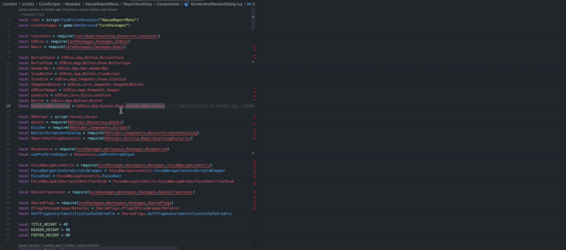

# AST Highlight Helper

A powerful VSCode extension for visualizing and analyzing Abstract Syntax Trees (AST) of Luau/Lua code with advanced diffing capabilities.

## 🚀 Features

### 🔍 **Live AST Editor** 
- **Interactive code editor** with live AST updates
- **Instant parsing** as you type or on-demand
- **Side-by-side view** of code and corresponding AST
- **Perfect for learning** how code structures translate to AST nodes



### ⚡ **AST Diff Analyzer**
- **Visual comparison** between two code snippets
- **Intelligent change detection** (additions, modifications, removals)
- **Parent context highlighting** shows which containers changed
- **Color-coded indicators**: 
  - 🟢 **Green** for additions (`+`)
  - 🔴 **Red** for removals (`-`) 
  - 🔵 **Blue** for modifications (`~`)
  - 🔵 **Circle** for containers with changes (`○`)


### 🎯 **Smart Tree Display**
- **Auto-collapse irrelevant nodes** (trivia, location, position data, etc)
- **Expandable/collapsible** tree branches
- **Clean visual hierarchy** for easy navigation

## 📦 Installation

### From VSCode Marketplace
1. Open VSCode
2. Go to Extensions (`Ctrl+Shift+X` / `Cmd+Shift+X`)
3. Search for "AST Highlight Helper"
4. Click **Install**

### From VSIX File
1. Download the `.vsix` file from [Releases](./releases)
2. Open VSCode Command Palette (`Ctrl+Shift+P` / `Cmd+Shift+P`)
3. Run `Extensions: Install from VSIX...`
4. Select the downloaded `.vsix` file

### Prerequisites
- **Lute**: Install via [Foreman](https://github.com/Roblox/foreman)
  ```bash
  foreman install
  ```

## 🎮 Usage

### Quick Start
1. **Open a Luau/Lua file** in VSCode
2. **Select some code** you want to analyze
3. **Press `Cmd+Shift+A`** (macOS) or `Ctrl+Shift+A` (Windows/Linux)
4. **Choose your mode**:
   - **Live Editor**: Interactive editing with live AST
   - **Diff Analyzer**: Compare two code snippets

### Keyboard Shortcuts
| Shortcut | Action |
|----------|--------|
| `Cmd+Shift+A` / `Ctrl+Shift+A` | Open AST Highlight Helper |
| `Enter` | Navigate to next search result |
| `Shift+Enter` | Navigate to previous search result |
| `Cmd+C` / `Ctrl+C` | Copy AST to clipboard |

### Advanced Usage

#### Live Editor Mode
- **Type or paste code** in the editor pane
- **Click "Parse AST"** for on-demand parsing
- **View real-time AST** as your code structure changes
- **Perfect for experimentation** and learning

#### Diff Analyzer Mode
- **Input two code snippets** in separate editors
- **Click "Analyze Transformation"** to see differences
- **Visual diff highlighting** shows exactly what changed
- **Understand code transformations** for refactoring and codemod work

## 🛠️ Development

### Setup
```bash
# Clone the repository
git clone https://github.com/your-username/ASTHighlightHelper.git
cd ASTHighlightHelper

# Install dependencies
npm install
cd frontend && npm install && cd ..

# Install Lute
foreman install
```

### Building
```bash
# Development build with watch mode
npm run watch

# Production build
npm run compile

# Package extension
vsce package
```

### Architecture

```
┌─────────────────────────────────────────────────────────────┐
│                    VSCode Extension                         │
├─────────────────┬─────────────────┬─────────────────────────┤
│   Backend       │   Frontend      │   External Tools        │
│   (Node.js)     │   (React)       │                         │
│                 │                 │                         │
│ • extension.ts  │ • App.tsx       │ • Lute (Luau parser)    │
│ • astParser.ts  │ • TreeNode.tsx  │ • json-diff-ts          │
│ • Luau helpers  │ • diffUtils.ts  │ • Foreman (tool mgmt)   │
└─────────────────┴─────────────────┴─────────────────────────┘
```

### Project Structure
```
ASTHighlightHelper/
├── src/                     # VSCode extension backend
│   ├── extension.ts         # Main entry point
│   └── astParser.ts         # Lute integration
├── frontend/                # React frontend
│   ├── src/
│   │   ├── App.tsx          # Main React component
│   │   ├── TreeNode.tsx     # AST tree rendering
│   │   └── diffUtils.ts     # Diff computation engine
│   └── build/              # Built React app
├── lua_helpers/            # Luau scripts for parsing
│   └── ast_parser.luau     # AST serialization script
├── package.json            # Extension manifest
└── README.md              # This file
```

## 🤝 Contributing

We welcome contributions! Here's how to get started:

1. **Fork the repository**
2. **Create a feature branch**: `git checkout -b feature/amazing-feature`
3. **Make your changes** and test thoroughly
4. **Commit your changes**: `git commit -m 'Add amazing feature'`
5. **Push to the branch**: `git push origin feature/amazing-feature`
6. **Open a Pull Request**

### Development Guidelines
- **Follow TypeScript best practices**
- **Add tests** for new functionality
- **Update documentation** as needed
- **Test with various Luau code samples**

## 📋 Requirements

- **VSCode** 1.60.0 or higher
- **Lute** (install via Foreman)
- **Node.js** 16+ (for development)

## 🐛 Known Issues

- Large AST trees (1000+ nodes) may have performance impact
- Diffing is not perfect, but it's a work in progress (open to suggestions and improvements)

## 🗺️ Roadmap

- [ ] **Better diffing**: Improve diffing algorithm to be more accurate, more usable, and properly display removals
- [ ] **AST Editing**: Modify AST nodes to generate/modify code in the editor

## 📄 License

This project is licensed under the MIT License - see the [LICENSE](LICENSE) file for details.

## 🙏 Acknowledgments

- **luau-lang** for 
- **rxi** for a lua json library
- **json-diff-ts** for robust JSON diffing capabilities

## 📞 Support

- **GitHub Issues**: [Report bugs or request features](https://github.com/your-username/ASTHighlightHelper/issues)
- **Discussions**: [Ask questions or share ideas](https://github.com/your-username/ASTHighlightHelper/discussions)

---

**Made with ❤️ for the Luau/Roblox development community**


 