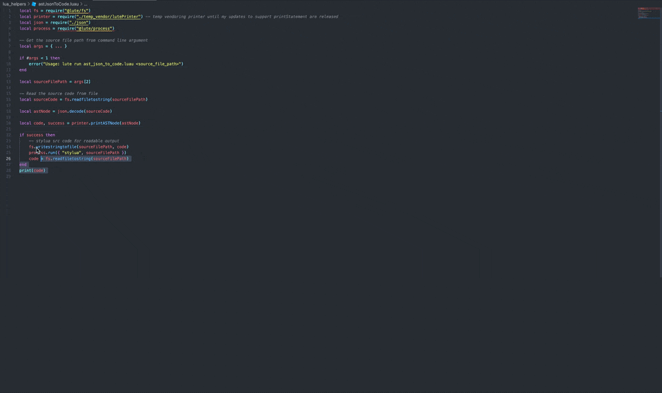
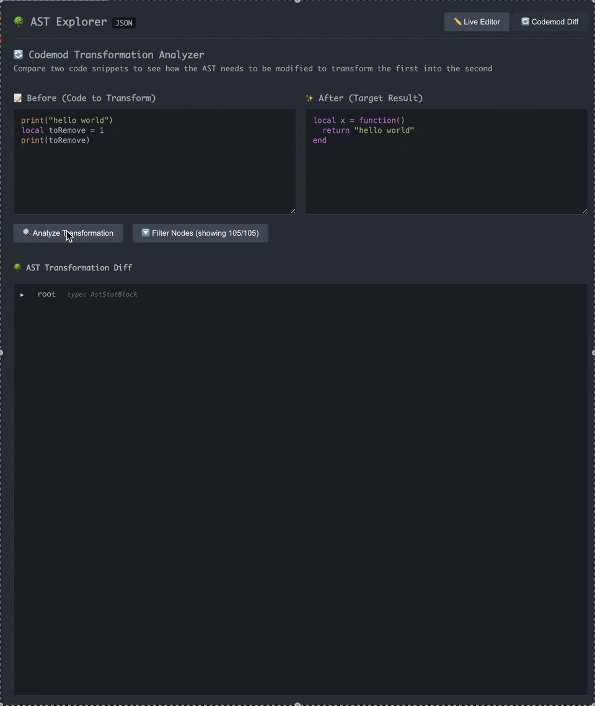

# AST Highlight Helper

A powerful VSCode extension for visualizing and analyzing Abstract Syntax Trees (AST) of Luau/Lua code with interactive type exploration, advanced diffing capabilities, and comprehensive AST node inspection.

## 🚀 Features

### 🔍 **Live AST Editor** 
- **Interactive code editor** with live AST updates
- **Instant parsing** as you type or on-demand
- **Side-by-side view** of code and corresponding AST
- **Perfect for learning** how code structures translate to AST nodes



### ⚡ **AST Diff Analyzer**
- **Visual comparison** between two code snippets
- **Intelligent change detection** (additions, modifications, removals)
- **Before/after type annotations** show type transformations
- **Symbol and color-coded indicators**: 
  - Additions (`+`)
  - Removals (`-`) 
  - Modifications (`~`)
  - Containers with changes (`○`)



### 🎯 **Smart Tree Display**
- **Expandable/collapsible** tree branches and nodes
- **Auto-collapse noisy nodes** (trivia, location, position data, etc)
- **Clean visual hierarchy** for easy navigation
- **Type-aware rendering** with enhanced annotation display

### 💡 **Advanced Type System**
- **Comprehensive type annotations** with tooltip details
- **Before/after type display** in diff mode

### 🔧 **Code Translation & Tooltips**
- **Hover over nodes** to show generated/translated code for AST nodes
- **Node path display** for non-translatable nodes

## 📦 Installation

### From Editor Marketplaces
- [VSCode](https://marketplace.visualstudio.com/items?itemName=wmccrthy.luau-ast-explorer)
- [Cursor](https://marketplace.cursorapi.com/items/?itemName=wmccrthy.luau-ast-explorer)

### From VSIX File
1. Download the `.vsix` file from [Releases](https://github.com/wmccrthy/LuauASTExplorer/releases)
2. Open Editor Command Palette (`Ctrl+Shift+P` / `Cmd+Shift+P`)
3. Run `Extensions: Install from VSIX...`
4. Select the downloaded `.vsix` file

### Prerequisites
- **Lute** [https://github.com/luau-lang/lute] Install via [Foreman](https://github.com/Roblox/foreman) or [Rokit](https://github.com/rojo-rbx/rokit)

## 🎮 Usage

### Quick Start
1. **Open a Luau/Lua file** in VSCode
2. **Select some code** you want to analyze
3. **Press `Cmd+Shift+A`** (macOS) or `Ctrl+Shift+A` (Windows/Linux)
4. **Choose your mode**:
   - **Live Editor**: Interactive editing with live AST
   - **Diff Analyzer**: Compare two code snippets

### Keyboard Shortcuts
| Shortcut | Action |
|----------|--------|
| `Cmd+Shift+A` / `Ctrl+Shift+A` | Open AST Highlight Helper |

### Advanced Usage

#### Live Editor Mode
- **Type or paste code** in the editor pane
- **Click "Parse AST"** for on-demand parsing
- **View real-time AST** as your code structure changes
- **Hover over type annotations** to see detailed property information
- **Hover over node keys** to see corresponding Luau code
- **Perfect for experimentation** and learning AST structure

#### Diff Analyzer Mode
- **Input two code snippets** in separate editors
- **Click "Analyze Transformation"** to see differences
- **Visual diff highlighting** shows exactly what changed
- **Type tooltips and code tooltips** work in diff mode for enhanced analysis
- **Before/after type annotations** show how types transform
- **Understand code transformations** for refactoring and codemod work

## 🛠️ Development

### Setup
```bash
# Clone the repository
git clone https://github.com/wmccrthy/LuauASTExplorer.git
cd LuauASTExplorer

# Install dependencies
npm install
cd frontend && npm install && cd ..

# Install Lute with foreman...
foreman install
# or with rokit...
rokit install
```

### Building
```bash
# Development build with watch mode
npm run watch

# Production build
npm run compile

# Package extension
vsce package
```

### Testing
```bash
# Run frontend tests
npm test

# Run Lua tests
lute run lua_tests/runner.luau
```

### Architecture

```
┌─────────────────────────────────────────────────────────────┐
│                    VSCode Extension                         │
├─────────────────┬─────────────────┬─────────────────────────┤
│   Backend       │   Frontend      │   External Tools        │
│ (Node + Luau)   │   (React)       │                         │
│                 │                 │                         │
│ • extension.ts  │ • App.tsx       │ • Lute (Luau parser)    │
│ • astParser.ts  │ • TreeNode.tsx  │ • json-diff-ts          │
│ • Luau helpers  │ • TypeTooltip   │ • highlight.js          │
│ • Type system   │ • diffUtils.ts  │ • Foreman (tool mgmt)   │
└─────────────────┴─────────────────┴─────────────────────────┘

Data Flow:
(initial code-> AST translation) Luau Code → Lute Parser → typeAnnotations.lua (adds _astType) → JSON → React UI
(node hover AST -> code translation) React UI Node → astJsonToCode.luau → lutePrinter.luau → Generated Src Code → Tooltips in React UI
```

### Project Structure
```
LuauASTExplorer/
├── src/                     # VSCode extension backend
│   ├── extension.ts         # Main entry point
│   └── astParser.ts         # Lute integration & communication
├── frontend/                # React frontend
│   ├── src/
│   │   ├── App.tsx          # Main React component
│   │   ├── components/      # UI components
│   │   │   ├── TreeNode.tsx        # AST tree rendering
│   │   │   ├── TypeTooltip.tsx     # Interactive type tooltips
│   │   │   ├── CodeTooltip.tsx     # Code translation tooltips
│   │   │   ├── LiveEditor.tsx      # Live editing mode
│   │   │   ├── DiffAnalyzer.tsx    # Diff analysis mode
│   │   │   └── CodeEditor.tsx      # Code input component
│   │   ├── utils/           # Core utilities
│   │   │   ├── astTypeDefinitions.ts  # Complete Luau AST type definitions
│   │   │   ├── astTypeHelpers.ts      # Type inference & manipulation
│   │   │   ├── diffUtils.ts           # Diff annotation
│   │   │   ├── syntaxHighlighting.ts  # Code highlighting & theme detection
│   │   │   ├── nodeEmphasisHelpers.ts # Auto-collapse logic
│   │   │   └── parsingMessageHandlers.ts # VSCode communication
│   │   ├── context/         # React context
│   │   │   └── codeTranslationContext.ts # Code tooltip state management
│   │   ├── hooks/           # Custom React hooks
│   │   │   └── useCodeTranslation.ts     # Code translation logic
│   │   ├── types/           # TypeScript definitions
│   │   │   └── typesAndInterfaces.ts     # Shared type definitions
│   │   └── tests/           # Frontend test suites
│   │       ├── TreeNode.test.tsx         # Comprehensive component tests
│   │       ├── astTypeHelpers.test.ts    # Type system tests
│   │       ├── diffUtils.test.ts         # Diff algorithm tests
│   │       ├── nodeEmphasisHelpers.test.ts # Auto-collapse tests
│   │       └── syntaxHighlighting.test.ts  # Syntax highlighting tests
│   └── build/              # Built React app
├── lua_helpers/            # Luau scripts for parsing
│   ├── astToJson.luau      # Main AST serialization script
│   ├── astJsonToCode.luau  # AST to code conversion
│   ├── typeAnnotations.lua # Enhanced type annotation system
│   ├── sortByPositionTable.lua # AST position sorting utilities
│   └── temp_vendor/
│       └── lutePrinter.luau    # Luau code generation engine
├── lua_tests/             # Lua test suites
│   ├── runner.luau        # Test runner
│   ├── typeAnnotations.spec.lua   # Type annotation tests
│   ├── printASTNode.spec.lua      # Code generation tests
│   ├── astJsonToCode.spec.lua     # AST conversion tests
│   └── helpers/           # Test utilities
│       ├── astJsonToCodeHelpers.lua   # Test case definitions
│       └── typeAnnotationTestHelpers.lua # Type testing utilities
├── ci_scripts/            # Build automation
│   └── readChangelog.ts   # Changelog processing
├── docs/                  # Documentation assets
│   ├── ASTExplorerDiffGIF.gif
│   └── ASTExplorerLiveEditorGIF.gif
├── .github/workflows/     # GitHub Actions
│   ├── release.yml        # Automated VSIX packaging
│   └── ci.yml            # Continuous integration
├── package.json           # Extension manifest
└── README.md             # This file
```

## 🤝 Contributing

We welcome contributions! Here's how to get started:

1. **Fork the repository**
2. **Create a feature branch**: `git checkout -b feature/amazing-feature`
3. **Make your changes** and test thoroughly
4. **Commit your changes**: `git commit -m 'Add amazing feature'`
5. **Push to the branch**: `git push origin feature/amazing-feature`
6. **Open a Pull Request**

### Development Guidelines
- **Follow TypeScript best practices**
- **Add tests** for new functionality (both frontend and Lua)
- **Update documentation** as needed
- **Test with various Luau code samples**
- **Use conventional commit messages** for changelog automation

### PR Title Format
Use these formats for automatic changelog creation:
- `#feat Add new feature description` → Creates feature changelog entry
- `#bug Fix issue description` → Creates bug fix changelog entry
- `#chore Update documentation` → No changelog entry (maintenance)

## 📋 Requirements

- **VSCode** 1.74.0 or higher
- **Lute** (latest version)
- **Foreman** or **Rokit** (See installation instructions linked above)
- **Node.js** 16+ (for development)

## 🐛 Known Issues

- Large AST trees (1000+ nodes) may have performance impact
- Some complex and niche types may not display perfectly in tooltips
- Code translation works for most AST nodes but may fall back to path display for edge cases (eg, Trivia, Position, Location)

## 📄 License

This project is licensed under the MIT License - see the [LICENSE](LICENSE) file for details.

## 🙏 Acknowledgments

- [**luau-lang**](https://github.com/luau-lang/) for all the luau tooling
- [**rxi**](https://github.com/rxi/json.lua) for a lua json library
- [**json-diff-ts**](https://github.com/ltwlf/json-diff-ts) for robust JSON diffing capabilities
- [**highlight.js**](https://highlightjs.org/) for syntax highlighting

## 📞 Support

- **GitHub Issues**: [Report bugs or request features](https://github.com/wmccrthy/LuauASTExplorer/issues)
- **Discussions**: [Ask questions or share ideas](https://github.com/wmccrthy/LuauASTExplorer/discussions)

---

**Made with ❤️ for the Luau/Roblox development community**


